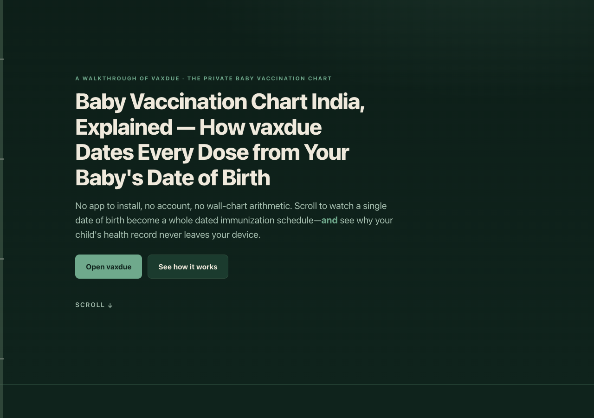

# vaxdue explained

**An animated, single-page walkthrough of [vaxdue](https://sreenivas-sadhu-prabhakara.github.io/vaxdue/) —
the private baby vaccination chart for India.** Scroll through the story: the wall-chart
problem, how one date of birth becomes a whole dated immunization schedule, the privacy the
browser itself enforces, and a short feature tour — then open the real tool.



## What this is

vaxdue turns a baby's date of birth into a dated, tickable, printable immunization schedule,
computed from the published **IAP** and **Government NIS** schedules, with the record kept
entirely on the device. This repo is the **explainer** for that tool: a scroll-driven
narrative built with nothing but HTML, CSS, and a few lines of vanilla JavaScript.

It is **not** the app itself — every call to action links to the live tool at
**[sreenivas-sadhu-prabhakara.github.io/vaxdue](https://sreenivas-sadhu-prabhakara.github.io/vaxdue/)**.

## The story it tells

1. **The problem** — a wall chart says "6 weeks," never "which Tuesday." Tired parents are
   left to do the calendar arithmetic.
2. **The solution** — watch a birch-trunk timeline date itself dose-by-dose from a single
   date of birth (the illustrative dates are produced by the same clamp-aware calendar
   arithmetic vaxdue uses, and are proven by the test suite).
3. **The guarantee** — `connect-src 'none'` in the page's Content-Security-Policy means the
   browser physically refuses every network request; the child's record cannot leave the device.
4. **A short tour** — IAP vs NIS kept separate, due / overdue chips, the printable clinic
   sheet, and fully-offline operation.

## Design

- **Motif:** the birch-trunk timeline with lenticel-dash tick marks — carried through the
  page, the reading-progress rail, the OG card, and the icon.
- **Palette:** birch-paper light mode and deep-pine-forest dark mode, with pine / marigold /
  clay status hues. Status is never colour-only (glyph + word everywhere).
- **Motion:** scroll-reveal and the timeline fill honour `prefers-reduced-motion` — with
  motion off, every scene renders in its final, fully legible state. No serif faces; system
  sans throughout; tabular figures for all dates.
- **Accessibility:** WCAG-AA in both light and dark, keyboard-operable, visible focus rings,
  a skip link, and a no-JavaScript fallback that shows all content.

## Quickstart

Open `index.html` in any modern browser — no build step, no server, no install.

- **Local:** double-click `index.html`, or run a static server in the folder.
- **Hosted:** this page is live on GitHub Pages; the tool it explains is
  **[vaxdue](https://sreenivas-sadhu-prabhakara.github.io/vaxdue/)**.

## Privacy

Like vaxdue, this page is built so nothing about you or your child is ever transmitted.

- A strict Content-Security-Policy sets `connect-src 'none'`: the page **cannot** make any
  network request even if it tried.
- No external fonts, scripts, images, or analytics. Everything is self-contained.
- Because there are no network dependencies, it works fully offline.

## Tests

```sh
node --check app.js
node --test
```

The suite re-derives the exact demo dates from the date of birth using the clamp-aware
`addWeeks` / `addMonths` arithmetic (month-end clamping, leap years, year rollover). If a demo
date is ever edited without a matching change to its date-of-birth or age offset, the tests fail —
so the explainer can never quietly show a fabricated date.

## Disclaimer

vaxdue and this explainer are an **informational reference only — not medical advice**, not a
medical device, and not a diagnosis. Your paediatrician's schedule always overrides the chart.
Dates are computed from a **dated snapshot** of the published IAP and Government NIS schedules;
immunization schedules are revised over time, so confirm current recommendations at your clinic.
Catch-up for missed or delayed doses is out of scope — the chart flags a dose overdue but a
doctor must plan the catch-up. The official immunization card issued by your health provider
remains the record of truth. This software is provided under the MIT License, "as is", without
warranty of any kind; the authors accept no liability for any loss, injury, or damage arising
from its use.

## License

[MIT](./LICENSE) © 2026 Sreenivas Sadhu Prabhakara
